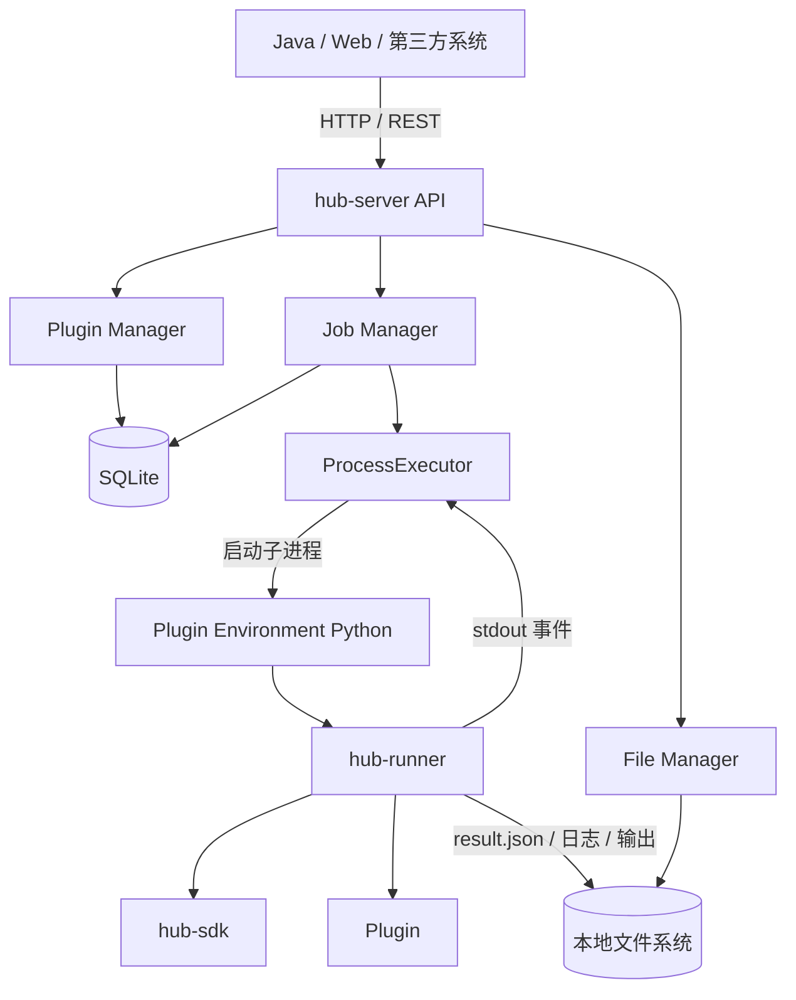
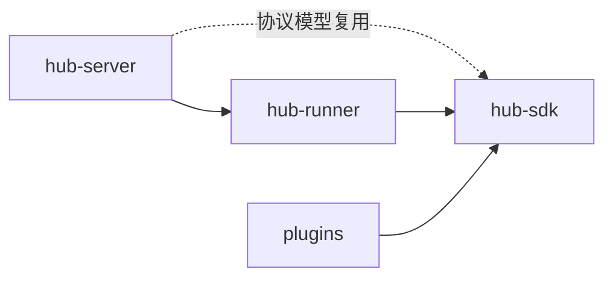
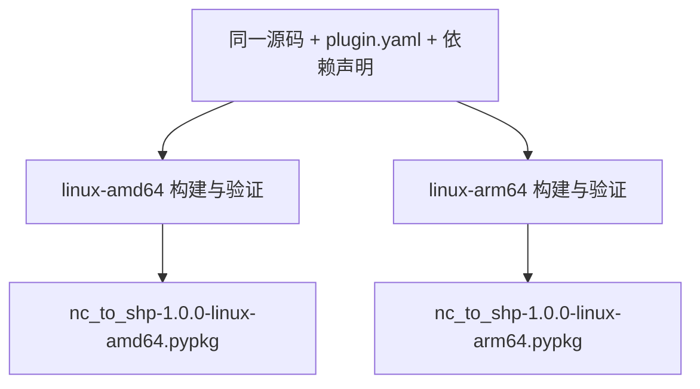
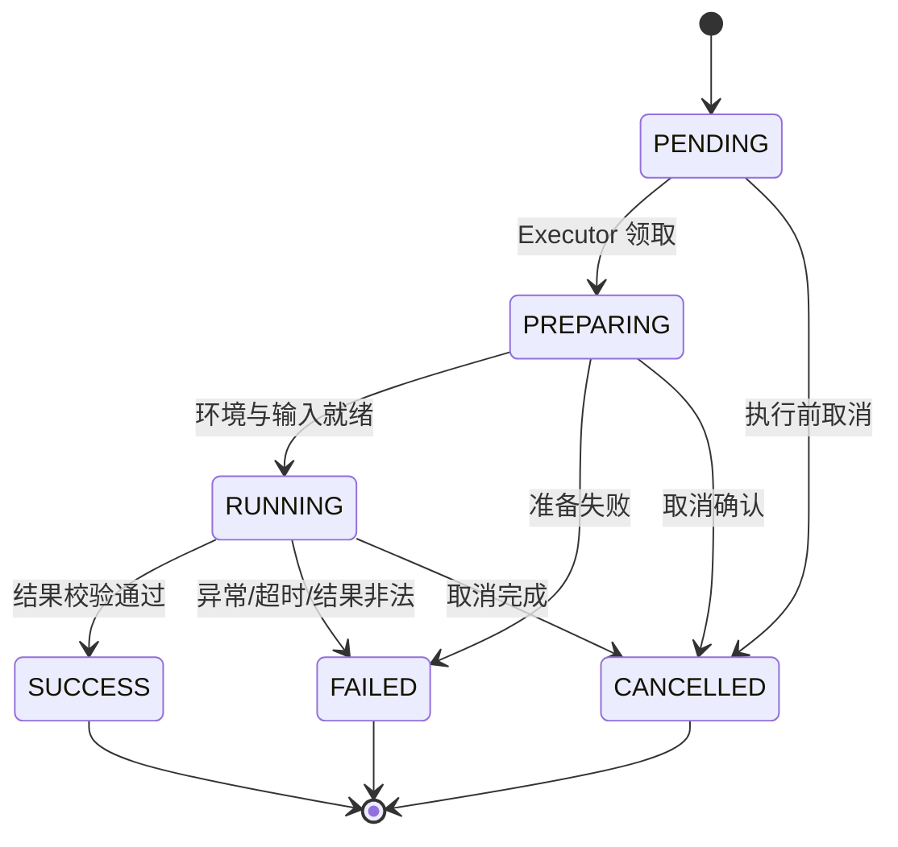
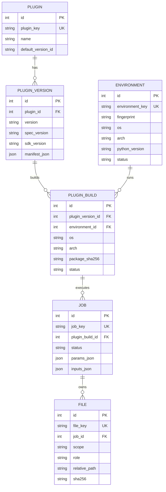

# Python Service Hub V1 设计文档

> 文档状态：设计基线  
> 版本：1.0  
> 日期：2026-09-04  
> 适用平台：Linux AMD64（开发/验证）、Linux ARM64（离线生产）

## 1. 文档目的

本文定义 Python Service Hub V1 的架构、模块边界、插件规范、运行时协议、数据模型、REST API、离线部署与跨架构发布策略。它是 V1 实现、测试、验收、插件开发和后续演进的共同基线。

本文中的“必须”“禁止”“应”分别表示强制要求、禁止行为和推荐要求。未明确纳入 V1 的能力不得阻塞 V1 交付。

## 2. 背景与目标

工作中会持续产生 NC、GIS、水文计算、Excel、数据库导入导出等 Python 数据处理程序。若每个程序都单独封装 Web 服务，会重复建设 HTTP、任务状态、日志、文件传输、部署和依赖管理，并导致大量难以维护的独立服务。

Python Service Hub 的定位不是通用微服务平台，而是：

> 统一安装、注册、运行和调用 Python 数据处理程序的插件式运行平台。

V1 目标如下：

- 新增业务能力时只开发插件，不修改 Hub 核心代码，也不重新发布 Hub。
- Java、Web 或第三方系统通过统一 REST API 创建异步任务。
- 每个插件使用独立、预构建的 Python 环境，避免依赖冲突。
- Hub 与插件进程隔离；Hub 不导入插件业务模块。
- 统一管理插件版本、平台构建、任务、输入输出、日志、取消和超时。
- 在 Linux AMD64 开发服务器完成平台开发验证，并以相同源码为 Linux ARM64 离线生产服务器生成独立构建。
- 通过版本、构建、环境和文件哈希，使历史任务尽可能可审计、可复现。

## 3. 非目标

V1 不实现以下能力：

- Service Plugin、常驻模型服务或插件自定义 HTTP 路由。
- DockerExecutor、RemoteExecutor、分布式 Worker。
- Celery、Redis、Kafka、Kubernetes 或服务注册中心。
- WebSocket/SSE 实时日志、暂停、恢复、自动重试和任务优先级。
- GPU 调度、CPU/内存硬限制、多租户和复杂权限体系。
- 对象存储、MinIO、NFS 抽象或 PostgreSQL 集群。
- 在生产 Hub 上执行 `pip install`、`conda install`、`apt install`、依赖解析或源码编译。
- 自动完成跨 CPU 架构的插件环境构建。

## 4. 设计原则

1. **Hub 管生命周期，Plugin 管业务，Environment 管依赖，Executor 管运行。**
2. **协议优先。** `plugin.yaml`、SDK 和 Job Runtime Protocol 是三个稳定边界。
3. **进程隔离。** 插件只能在其 Environment 中由 Runner 子进程加载。
4. **统一 Job API。** 不为不同插件动态生成不同 REST 路由。
5. **文件是一等资源。** 大数据通过文件传递，小型结构化结果才进入 JSON。
6. **输入不可变、构建不可变、环境不可变。** 内容改变必须产生新版本或未来的 Build Revision。
7. **运行时使用相对路径。** 协议不得记录绑定机器的绝对路径。
8. **离线优先。** 生产运行和安装不依赖公网、PyPI 或 conda-forge。
9. **源码与平台 Build 分离。** `plugin.yaml` 描述插件是什么，`build.json` 描述产物为谁构建。
10. **先简单、留扩展点。** V1 使用单机、SQLite、本地文件系统和 ProcessExecutor。

## 5. 技术基线

| 领域 | V1 选择 |
|---|---|
| API | FastAPI |
| Web Server | Uvicorn |
| 配置与协议模型 | Pydantic 2.x，精确锁定版本 |
| ORM | SQLAlchemy |
| 数据库 | SQLite |
| 插件描述 | YAML |
| 执行方式 | `subprocess` + ProcessExecutor |
| 环境格式 | 预构建 Conda/Micromamba 环境包，推荐 `conda-pack` + `tar.zst` |
| 文件存储 | 本地文件系统 |
| 日志 | Python `logging` 或 Loguru，最终统一落盘 |
| 外部 ID | UUID/ULID 风格字符串，如 `job_01K...` |
| 部署 | Docker / Docker Compose，多架构镜像与离线归档 |

Hub Server 环境应保持轻量，只包含平台依赖，禁止安装 GDAL、GeoPandas、Rasterio、netCDF4、PyTorch 等业务依赖。

## 6. 总体架构



核心执行链：

```text
客户端上传文件
  → 创建 Job
  → Hub 解析 PluginVersion 和当前平台 PluginBuild
  → 固化参数与输入快照
  → ProcessExecutor 使用 Environment 中的 Python 启动 Runner
  → Runner 加载插件并调用 run(params, inputs, context)
  → Runner 写 result.json，Hub 注册输出 File
  → Job 进入 SUCCESS / FAILED / CANCELLED
```

## 7. 模块与依赖边界

### 7.1 Monorepo 模块

```text
python-service-hub/
├── hub-sdk/
├── hub-runner/
├── hub-server/
├── plugins/
├── docs/
├── scripts/
├── tests/
├── docker/
├── config/
├── pyproject.toml
├── docker-compose.yml
└── README.md
```

依赖方向：



禁止反向依赖。尤其禁止插件依赖 FastAPI、SQLAlchemy、Hub Repository 或 Hub 数据库。

### 7.2 `hub-server`

负责“管理”：

- REST API、OpenAPI 与统一错误转换。
- Plugin、PluginVersion、PluginBuild 生命周期与 Registry。
- Environment 安装、注册、解析、健康检查和引用管理。
- Job 创建、调度、状态转换、取消与超时控制。
- 输入文件准备、输出文件校验与注册。
- SQLite/SQLAlchemy 持久化。
- ProcessExecutor、子进程 stdout/stderr 捕获和事件消费。

不负责加载插件业务代码，不负责构建或在线安装插件依赖。

建议内部结构：

```text
hub-server/src/python_hub/
├── api/v1/
├── schemas/
├── models/
├── repositories/
├── services/
├── executors/
├── registry/
├── storage/
├── config/
└── main.py
```

### 7.3 `hub-runner`

负责“执行桥梁”：

- 读取和校验 `job.json`。
- 解析 Job 根目录下的相对路径。
- 动态加载指定插件入口函数。
- 创建 `PluginContext` 和 `InputFile`。
- 调用 `run(params, inputs, context)`。
- 将日志与进度编码为 Runner Event。
- 捕获 SDK 异常、取消和未处理异常。
- 校验 `PluginResult` 并原子写入 `result.json`。

Runner 不访问 Hub 数据库，不理解业务数据，不提供 HTTP 服务。

### 7.4 `hub-sdk`

负责“约定”，以独立纯 Python wheel 发布并预装进插件环境：

- `PluginContext`
- `InputFile`
- `OutputFile`
- `PluginResult`
- `PluginError`、`PluginValidationError`、`PluginExecutionError`、`PluginCancelledError`
- 与 V1 协议直接相关的轻量类型

SDK 不依赖 FastAPI、SQLAlchemy、Redis 或 Hub 内部包。SDK 版本必须写入插件声明/构建元数据并锁定兼容范围。

### 7.5 `plugins`

负责具体业务：

- 读取已经解析的普通参数和输入文件。
- 执行业务计算。
- 使用 Context 记录日志、报告进度和检查取消。
- 只向 `work_dir` 写中间文件，只向 `output_dir` 写最终产物。
- 成功返回 `PluginResult`，可预期业务错误抛出 SDK 异常。

插件不负责 HTTP、数据库、Job 状态、绝对部署路径或结果协议封装。

## 8. Pydantic 使用原则

“V1 使用 Pydantic”指 Python Service Hub V1 将 Pydantic 作为基础设施依赖；实现时使用 Pydantic 2.x API，并在离线发布锁文件中精确固定实际小版本。

Pydantic 用于：

- `plugin.yaml` → `PluginManifest`
- `build.json` → `PluginBuildManifest`
- REST 请求与响应
- `job.json` → `JobRuntimeSpec`
- `result.json` → `JobResult`
- Runner Event → 判别联合类型

原则：

- Pydantic Schema 与 SQLAlchemy Entity 分离。
- REST 静态模型只校验外层结构；插件参数依据 manifest 动态校验。
- 可使用 `create_model()` 为具体插件版本生成参数模型。
- Job 保存校验并填充默认值后的 resolved params，不只保存原始请求。
- 默认拒绝未知关键字段；可扩展 metadata 字段必须显式定义。
- 可变默认值使用 `Field(default_factory=...)`。
- 校验错误统一转换为 HTTP 422 的平台错误格式。

示例：

```python
from typing import Any
from pydantic import BaseModel, Field

class CreateJobRequest(BaseModel):
    plugin_id: str
    version: str | None = None
    params: dict[str, Any] = Field(default_factory=dict)
    inputs: dict[str, str | list[str]] = Field(default_factory=dict)

class PluginInfo(BaseModel):
    id: str = Field(pattern=r"^[a-z][a-z0-9_]{2,63}$")
    name: str
    version: str
    description: str | None = None
    tags: list[str] = Field(default_factory=list)
```

## 9. 插件静态规范：`plugin.yaml` v1.0

### 9.1 定位

`plugin.yaml` 是平台无关的源码级静态契约，回答“插件是什么、如何调用、输入输出是什么”。它不得绑定某个 CPU 架构，也不得包含密钥。

插件 ID 必须匹配 `^[a-z][a-z0-9_]{2,63}$`；插件版本采用 SemVer。`spec_version` 与插件业务版本相互独立。

### 9.2 完整示例

```yaml
spec_version: "1.0"

plugin:
  id: nc_to_shp
  name: NC转Shapefile
  version: "1.0.0"
  description: 将水动力模型 NetCDF 结果转换为 Shapefile
  author: Lane
  category: gis
  tags: [netcdf, gis, water]

sdk:
  version: "1.0"

runtime:
  type: process
  python:
    version: "3.10"
  environment:
    type: conda
    file: environment.yml

entrypoint:
  module: src.main
  function: run

parameters:
  - name: start_time
    label: 开始时刻
    type: integer
    required: false
    default: 1
    min: 1

  - name: end_time
    label: 结束时刻
    type: integer
    required: false

  - name: target_epsg
    label: 输出坐标系
    type: integer
    required: false
    default: 3857

  - name: method
    label: 插值方法
    type: enum
    required: false
    default: nearest
    options: [nearest, linear, cubic]

inputs:
  - name: nc_file
    label: NC结果文件
    type: file
    required: true
    extensions: [.nc, .h5, .hdf5]
    max_size: 10737418240

outputs:
  - name: result_files
    label: 输出文件
    type: files
    required: true

execution:
  timeout: 3600
  concurrency: 1

environment_variables:
  required: []

healthcheck:
  enabled: true
  type: import
```

### 9.3 字段约束

| 区域 | V1 约束 |
|---|---|
| `runtime.type` | 仅允许 `process` |
| 参数类型 | `string`、`integer`、`number`、`boolean`、`enum`、`datetime` |
| 输入类型 | `file`、`files` |
| 输出类型 | 小型 `object`、`file`、`files` |
| `execution.timeout` | 正整数秒，由 Hub 强制执行 |
| `execution.concurrency` | 同一 Build 最大并发数 |
| `healthcheck.type` | `import`；可选扩展为 `function` |

参数和文件必须分离。Shapefile 输入推荐以 ZIP 上传；平台校验并解压必要的 `.shp/.shx/.dbf` 组件。输出 Shapefile 可由 Runner/Hub 打包为 ZIP。

`environment_variables` 只声明变量名，值由平台配置并在运行时注入。禁止在 manifest 中保存密码、Token 或连接凭据。

## 10. 插件源码与平台 Build 分离

同一份插件源码可产生多个目标平台 Build：



`build.json` 描述部署产物，例如：

```json
{
  "schema_version": "1.0",
  "build_id": "build_01K...",
  "plugin_id": "nc_to_shp",
  "plugin_version": "1.0.0",
  "target": {
    "os": "linux",
    "arch": "arm64"
  },
  "runtime": {
    "python_version": "3.10",
    "environment_format": "conda-pack",
    "environment_path": "runtime/env.tar.zst",
    "environment_sha256": "..."
  },
  "sdk_version": "1.0.0",
  "source_sha256": "...",
  "built_at": "2026-09-04T12:00:00Z"
}
```

建议 `.pypkg` 使用 ZIP 容器：

```text
nc_to_shp-1.0.0-linux-arm64.pypkg
├── plugin.yaml
├── build.json
├── src/
├── runtime/
│   └── env.tar.zst
├── README.md
└── checksums.sha256
```

`plugin.yaml` 不包含 `targets`；平台信息只出现在 Build 及其数据库记录中。

## 11. 跨架构与离线构建策略

开发服务器为 Linux AMD64，生产服务器为离线 Linux ARM64。策略如下：

- Hub 源码、配置、数据库 Schema 和 API 在两种架构上保持一致。
- 插件源码和 `plugin.yaml` 保持一致。
- `linux-amd64` 与 `linux-arm64` 必须分别构建运行环境和 `.pypkg`。
- NumPy、SciPy、GDAL、Rasterio、netCDF4、h5py 等二进制依赖不得跨架构复制。
- 插件发布者负责在目标平台或兼容构建环境中构建并验证 Environment。
- QEMU/buildx 可辅助构建，但涉及原生库的生产包应至少在真实 ARM64 Linux 上完成健康检查和代表性任务验证。
- Hub 安装时规范化 `x86_64 → amd64`、`aarch64 → arm64`，并拒绝不匹配构建。

上传 ARM64 包到 AMD64 Hub 时返回：

```json
{
  "success": false,
  "error": {
    "code": "PLATFORM_MISMATCH",
    "message": "插件目标平台 linux-arm64 与当前平台 linux-amd64 不一致",
    "details": {
      "expected": "linux-amd64",
      "actual": "linux-arm64"
    }
  }
}
```

## 12. Environment 管理

Environment 是已经构建、安装并可运行的环境实体，不是待解析的依赖清单。

生产 `EnvironmentManager` 负责：

- `install_package()`：验证后解压预构建环境。
- `register()`：记录元数据和运行路径。
- `validate()`：校验 OS、架构、Python、SDK、大小与哈希。
- `healthcheck()`：验证 Python、Runner、SDK 和插件入口。
- `resolve_python()`：解析环境内相对 Python 可执行路径。
- `remove()`：在无引用且符合保留策略时移除。
- `reuse()`：按 fingerprint 复用环境；V1 数据模型支持，实现可延后。

生产 Hub 明确不负责：

```text
conda/micromamba dependency resolution
pip dependency resolution
联网下载 wheel/conda package
编译 GDAL/SciPy 等原生依赖
apt/yum 安装系统包
跨架构构建
```

Environment 状态：`INSTALLING → READY`，失败进入 `BROKEN`；删除流程为 `REMOVING → REMOVED`。只有 `READY` Environment 对应的 `ENABLED` PluginBuild 可以创建 Job。

fingerprint 至少覆盖：目标 OS、架构、Python 版本、SDK 版本和环境内容哈希。V1 可先每个 Build 安装独立 Environment，后续再按 fingerprint 去重。

## 13. Plugin SDK v1.0

### 13.1 入口契约

```python
def run(
    params: dict,
    inputs: dict[str, InputFile | list[InputFile]],
    context: PluginContext,
) -> PluginResult:
    ...
```

Hub 已完成类型、必填、范围、枚举、扩展名和文件存在性校验。插件仍须完成跨字段或业务语义校验。

### 13.2 核心类型

```python
class InputFile:
    id: str
    name: str
    path: str       # Runner 解析后的本地路径
    size: int
    extension: str
    sha256: str

class OutputFile:
    name: str
    path: str       # 相对于 output_dir
    format: str | None = None

class PluginResult:
    message: str | None = None
    data: dict = {}
    files: list[OutputFile] = []
```

`PluginContext` 最小能力：

```text
job_id, plugin_id, plugin_version
input_dir, work_dir, output_dir
logger
progress(percent, message=None)
is_cancelled()
check_cancelled()
output_file(relative_path)
work_file(relative_path)
```

路径辅助函数必须阻止 `..`、绝对路径和符号链接逃逸 Job 根目录。

### 13.3 异常体系

- `PluginError`：插件异常基类。
- `PluginValidationError`：业务输入语义不合法。
- `PluginExecutionError`：业务执行失败。
- `PluginCancelledError`：协作式取消。

面向调用方返回稳定的 `code/message`；完整 traceback 只进入受控日志，不写入 `result.json`，也不直接暴露给普通 API 调用方。

### 13.4 插件示例

```python
from python_hub_sdk import (
    OutputFile,
    PluginResult,
    PluginValidationError,
)

def run(params, inputs, context):
    nc_file = inputs["nc_file"]
    start_time = params["start_time"]
    end_time = params.get("end_time")

    if end_time is not None and end_time < start_time:
        raise PluginValidationError(
            code="INVALID_TIME_RANGE",
            message="end_time 不能小于 start_time",
        )

    context.logger.info("开始处理文件: %s", nc_file.name)
    context.progress(10, "开始读取 NC")
    context.check_cancelled()

    output_path = context.output_file("result.zip")
    process_nc(nc_file.path, output_path)

    context.progress(100, "处理完成")
    return PluginResult(
        message="NC转换完成",
        data={"start_time": start_time, "end_time": end_time},
        files=[OutputFile(name="转换结果", path="result.zip", format="zip")],
    )
```

## 14. Job Runtime Protocol v1.0

### 14.1 Job 目录

```text
data/jobs/job_01K.../
├── job.json             # 创建后只读
├── result.json          # Runner 原子写入
├── .cancel              # 可选取消标记
├── input/               # 只读任务输入
├── work/                # 可清理中间文件
├── output/              # 最终输出
└── logs/
    ├── plugin.log
    └── runner.log
```

任务创建时将上传文件复制或硬链接至 `input/`，不得让 Job 直接依赖临时上传目录。所有协议路径相对于 Job 根目录。

### 14.2 `job.json`

```json
{
  "protocol_version": "1.0",
  "job": {
    "id": "job_01K...",
    "created_at": "2026-09-04T14:30:00+08:00"
  },
  "plugin": {
    "id": "nc_to_shp",
    "version": "1.0.0",
    "build_id": "build_01K..."
  },
  "params": {
    "start_time": 1,
    "end_time": 24,
    "target_epsg": 3857
  },
  "inputs": {
    "nc_file": {
      "id": "file_01K...",
      "name": "model.nc",
      "path": "input/model.nc",
      "size": 185624733,
      "extension": ".nc",
      "sha256": "7f7d..."
    }
  },
  "directories": {
    "input": "input",
    "work": "work",
    "output": "output",
    "logs": "logs"
  },
  "execution": {
    "timeout": 3600
  }
}
```

### 14.3 `result.json`

成功示例：

```json
{
  "protocol_version": "1.0",
  "job_id": "job_01K...",
  "status": "SUCCESS",
  "started_at": "2026-09-04T14:30:05+08:00",
  "finished_at": "2026-09-04T14:31:28+08:00",
  "duration_ms": 83000,
  "message": "NC转换完成",
  "data": {
    "time_count": 24,
    "point_count": 158624
  },
  "files": [
    {
      "name": "水深结果",
      "path": "depth.zip",
      "format": "zip",
      "size": 5823674,
      "sha256": "abcd..."
    }
  ],
  "error": null
}
```

失败示例：

```json
{
  "protocol_version": "1.0",
  "job_id": "job_01K...",
  "status": "FAILED",
  "started_at": "2026-09-04T14:30:05+08:00",
  "finished_at": "2026-09-04T14:30:08+08:00",
  "duration_ms": 3000,
  "message": "任务执行失败",
  "data": {},
  "files": [],
  "error": {
    "type": "PluginValidationError",
    "code": "NC_VARIABLE_MISSING",
    "message": "NC文件中缺少 stage 变量"
  }
}
```

`result.json` 由 Runner 生成，不由插件直接写入。Runner 应先写临时文件、刷新后原子重命名，避免 Hub 读到半个 JSON。

## 15. Runner Event Protocol v1.0

Runner 通过 stdout 输出带固定前缀的单行 JSON：

```text
@@HUB@@{"protocol_version":"1.0","type":"progress","percent":50,"message":"正在生成Shapefile"}
```

V1 必须支持：

```json
{"protocol_version":"1.0","type":"progress","percent":50,"message":"正在生成Shapefile"}
```

```json
{"protocol_version":"1.0","type":"log","level":"INFO","message":"读取NC完成"}
```

规则：

- `percent` 范围为 0–100；Hub 可节流数据库更新。
- 非 `@@HUB@@` stdout 内容按普通插件日志处理。
- stderr 全部进入 Runner/错误日志，但不得原样返回外部调用方。
- 无法解析的协议行记警告并当普通日志保留，不应导致任务直接失败。
- `artifact`、`heartbeat`、`completed` 事件为后续扩展，V1 完成状态以进程退出码和 `result.json` 为准。

## 16. 任务状态机



| 状态 | 含义 |
|---|---|
| `PENDING` | Job 已持久化，等待执行 |
| `PREPARING` | 准备目录、输入、Environment 和命令 |
| `RUNNING` | Runner/Plugin 子进程运行中 |
| `SUCCESS` | 进程、结果协议和输出校验全部成功 |
| `FAILED` | 准备、执行、超时或校验失败 |
| `CANCELLED` | 取消请求已实际生效并完成收尾 |

超时不单独建状态；使用 `FAILED + EXECUTION_TIMEOUT`。状态终态不可逆。

## 17. 取消、超时与日志

取消流程：

1. API 将 `cancel_requested=true`，创建 Job 根目录下 `.cancel`。
2. `context.check_cancelled()` 检测标记并抛出 `PluginCancelledError`。
3. Runner 写 `CANCELLED` 结果后退出。
4. 若宽限期内未退出，Hub 发送 terminate；仍未退出则 kill 整个进程组。
5. 只有进程已经结束并完成收尾，Job 才进入 `CANCELLED`。

超时由 Hub 根据 manifest 的 `execution.timeout` 强制执行，采用 terminate → 宽限期 → kill，最终进入 `FAILED`，错误码为 `EXECUTION_TIMEOUT`。

日志分层：

- `plugin.log`：SDK logger、普通 stdout 和业务日志。
- `runner.log`：入口加载、协议错误、traceback 和执行器诊断。
- Hub 平台日志：API、调度、安装与持久化操作。

V1 日志 API 支持 `tail` 行数限制，不一次返回超大日志；实时推送留至后续版本。

## 18. 数据模型



### 18.1 `Plugin`

插件逻辑身份：`id`、`plugin_key`、`name`、`description`、`category`、`author`、`default_version_id`、时间戳。`plugin_key` 唯一。

### 18.2 `PluginVersion`

业务版本：`plugin_id`、`version`、`spec_version`、`sdk_version`、`manifest_json`、状态、安装时间。唯一约束为 `(plugin_id, version)`。完整解析后 manifest 作为审计快照保存。

### 18.3 `PluginBuild`

某业务版本在某平台的不可变部署构建：`plugin_version_id`、`os`、`arch`、包格式/路径/大小/SHA256、`environment_id`、`build_metadata_json`、安装路径、状态和时间戳。

V1 唯一约束为 `(plugin_version_id, os, arch)`，相同版本和平台禁止覆盖安装。状态：`UPLOADED → VALIDATING → INSTALLING → READY → ENABLED`，也可进入 `FAILED` 或 `DISABLED`。

### 18.4 `Environment`

字段包括：`environment_key`、`fingerprint`、OS、架构、Python 版本、包格式/路径/大小/SHA256、运行路径、Python 相对可执行路径、状态、元数据、健康检查时间。

### 18.5 `Job`

字段包括：`job_key`、`plugin_build_id`、状态、进度、进度消息、resolved `params_json`、不可变 `inputs_json`、Job 相对目录、消息、错误类型/码/消息、时间戳、耗时、`cancel_requested`、可空 `created_by` 和未来清理字段。

Job 必须绑定具体 `PluginBuild`，而不是只保存插件 ID/版本。

### 18.6 `File`

统一表示上传文件与 Job 输入/输出：`file_key`、可空 `job_id`、`scope`（`UPLOAD/JOB`）、`role`（`INPUT/OUTPUT`）、`logical_name`、原始文件名、相对路径、格式、扩展名、MIME、大小、SHA256、时间戳和可选过期时间。

插件包和 Environment 包不进入 File 表，分别由 `PluginBuild` 和 `Environment` 管理。

### 18.7 删除与保留

- 被 Job 引用的 PluginVersion、PluginBuild 不得物理删除。
- 被 Build 引用的 Environment 不得删除。
- 卸载优先使用状态/逻辑删除，保留审计记录。
- Job 记录和文件生命周期分离；未来可清理大文件并保留 Job 元数据，记录 `data_purged_at`。

## 19. REST API V1

统一前缀：`/api/v1`。成功直接返回资源；失败统一返回 ErrorResponse。

| 分类 | 方法与路径 | 说明 |
|---|---|---|
| Plugin | `POST /plugins/install` | 上传并安装目标平台 `.pypkg` |
| Plugin | `GET /plugins` | 分页插件列表 |
| Plugin | `GET /plugins/{plugin_id}` | 插件与已安装版本详情 |
| Plugin | `GET /plugins/{plugin_id}/versions` | 版本列表 |
| Plugin | `GET /plugins/{plugin_id}/{version}/manifest` | 完整参数/输入输出规范 |
| Plugin | `POST /plugins/{plugin_id}/{version}/enable` | 启用当前平台 Build |
| Plugin | `POST /plugins/{plugin_id}/{version}/disable` | 停用当前平台 Build |
| Plugin | `DELETE /plugins/{plugin_id}/{version}` | 满足引用规则时卸载/逻辑删除 |
| File | `POST /files` | `multipart/form-data` 上传 |
| File | `GET /files/{file_id}` | 文件元数据 |
| File | `GET /files/{file_id}/download` | 流式下载 |
| File | `DELETE /files/{file_id}` | 满足引用规则时删除 |
| Job | `POST /jobs` | 异步创建任务 |
| Job | `GET /jobs` | 分页及条件查询 |
| Job | `GET /jobs/{job_id}` | 状态、进度和小型结果 |
| Job | `POST /jobs/{job_id}/cancel` | 请求取消 |
| Job | `GET /jobs/{job_id}/logs` | 日志，支持 `tail` |
| Job | `GET /jobs/{job_id}/outputs` | 输出文件列表 |
| System | `GET /system/health` | 轻量存活检查 |
| System | `GET /system/info` | Hub、平台与部署模式信息 |

### 19.1 插件安装

```http
POST /api/v1/plugins/install
Content-Type: multipart/form-data
```

安装顺序：安全接收 → SHA256 → 安全解包到临时目录 → Pydantic 校验两个 manifest → 校验平台/版本/SDK → 校验 Environment → 原子安装源码和环境 → 健康检查 → 数据库事务注册 → `READY`。安装后不自动 `ENABLED`。

### 19.2 文件上传

```json
{
  "file_id": "file_01K...",
  "name": "model.nc",
  "size": 185624733,
  "sha256": "abc...",
  "status": "AVAILABLE"
}
```

上传与 Job 创建分离，以支持大文件进度、失败重试、文件复用和未来迁移对象存储。

### 19.3 创建 Job

```json
{
  "plugin_id": "nc_to_shp",
  "version": "1.0.0",
  "params": {
    "start_time": 1,
    "end_time": 24,
    "target_epsg": 3857
  },
  "inputs": {
    "nc_file": "file_01K123"
  }
}
```

`version` 可省略，此时解析 Plugin 的默认 `ENABLED` 版本；数据库和 `job.json` 必须保存解析后的精确版本与 Build。

创建校验顺序：Plugin → 版本 → 当前平台 Build → `ENABLED` → Environment `READY` → 外层 Schema → 动态参数 → 输入结构 → File 元数据/存在性/大小/扩展名 → 固化快照 → 创建目录与 `job.json` → 提交 Executor。接口立即返回 HTTP 201 和 `PENDING`。

### 19.4 查询和输出

Job 列表支持：`status`、`plugin_id`、`created_from`、`created_to`、`page`、`page_size`。Job 详情可以返回小型 `data`，大结果仅通过 outputs/File 下载。

```json
{
  "job_id": "job_01K...",
  "status": "RUNNING",
  "progress": 62,
  "progress_message": "正在处理第15/24个时刻",
  "created_at": "2026-09-04T15:00:00+08:00",
  "started_at": "2026-09-04T15:00:02+08:00",
  "finished_at": null
}
```

取消接口只表示请求已接收，不提前声称已经取消：

```json
{
  "job_id": "job_01K...",
  "status": "RUNNING",
  "cancel_requested": true
}
```

### 19.5 System API

`/system/health` 只做轻量探活，不遍历插件：

```json
{"status":"UP"}
```

`/system/info`：

```json
{
  "hub_version": "1.0.0",
  "platform": {"os":"linux","arch":"arm64"},
  "python": "3.12.x",
  "deployment_mode": "offline"
}
```

## 20. 错误规范

```json
{
  "success": false,
  "error": {
    "code": "PLUGIN_NOT_FOUND",
    "message": "插件 nc_to_shp 不存在",
    "details": null
  }
}
```

| HTTP 状态 | 使用场景 |
|---|---|
| 200 | 查询或操作成功 |
| 201 | Plugin/File/Job 创建成功 |
| 400 | 通用请求语义错误 |
| 404 | Plugin/Job/File 不存在 |
| 409 | 同版本同平台重复安装或状态冲突 |
| 413 | 上传超过平台限制 |
| 422 | Pydantic/manifest/平台/业务结构校验失败 |
| 500 | 未预期 Hub 内部错误 |

核心稳定错误码至少包括：`PLUGIN_NOT_FOUND`、`PLUGIN_NOT_ENABLED`、`PLUGIN_VERSION_NOT_FOUND`、`PLUGIN_BUILD_NOT_FOUND`、`PLATFORM_MISMATCH`、`RUNTIME_PACKAGE_REQUIRED`、`SDK_VERSION_INCOMPATIBLE`、`MANIFEST_INVALID`、`FILE_NOT_FOUND`、`FILE_TYPE_NOT_ALLOWED`、`JOB_STATE_CONFLICT`、`EXECUTION_TIMEOUT`、`RESULT_INVALID`、`OUTPUT_FILE_MISSING`、`UNEXPECTED_ERROR`。

## 21. 文件上传、输出与复现

- 上传文件存于 `data/uploads/{file_id}/`，文件名由平台生成，原始名只作元数据。
- 创建 Job 时复制或硬链接至 `jobs/{job_id}/input/`，随后视为不可变。
- Hub 为上传、任务输入和输出计算 SHA256 与大小。
- 输出路径必须在 `output/` 内；注册前验证存在、普通文件、大小和路径边界。
- 小型 JSON `data` 应有可配置上限；超限内容必须写文件。
- 文件下载采用流式响应并设置安全的 `Content-Disposition`。
- Job 的 resolved params、输入哈希、PluginBuild 包哈希、Environment fingerprint 和协议文件共同构成复现证据。

## 22. 安全与校验

### 22.1 安装包安全

- 限制上传体积、单文件数、解压后总大小和压缩比，防止压缩炸弹。
- 拒绝绝对路径、`..`、符号链接/硬链接逃逸和重复覆盖条目（Zip Slip/Tar Slip）。
- SHA256 必须与 `build.json`/校验清单一致。
- 先在隔离临时目录校验，再原子移动到托管目录。
- 包签名属于后续增强；离线介质仍需组织级来源控制与哈希交接。

### 22.2 运行安全

- 使用参数数组启动子进程，禁止 shell 字符串拼接。
- 进程采用最小权限非 root 用户；插件目录和 Environment 默认只读。
- 每个 Job 只能写自己的 `work/`、`output/` 和 `logs/`。
- 严格校验所有相对路径的规范化结果和真实路径边界。
- 默认不向插件注入 Hub 数据库、管理凭据或宿主机敏感目录。
- 环境变量白名单注入，日志对密钥进行脱敏。
- 取消/超时终止整个插件进程组，避免遗留子进程。
- V1 的进程隔离不是强安全沙箱；不可信第三方插件应在后续 DockerExecutor/容器沙箱中运行。

### 22.3 协议与数据安全

- `plugin.yaml`、`build.json`、`job.json`、`result.json` 和事件都必须经 Pydantic 校验。
- 对 manifest 的字段数量、字符串长度、参数数量和嵌套深度设上限。
- 日志和错误响应不得泄露绝对路径、环境变量、Token 或完整 traceback。
- SQLite 仅存管理元数据；禁止存插件包、大文件和超大日志。

## 23. 不可变与可复现性

- 同一 `(plugin_id, version, os, arch)` 在 V1 中只能有一个正式 Build，不允许覆盖。
- 代码或依赖变化必须提升插件版本；未来需要同版本重构建时再引入 `build_revision`。
- Environment 安装后禁止人工 `pip install` 或修改文件；变化必须生成新环境。
- `job.json` 创建后只读；结果由 Runner 原子生成。
- Job 永久记录精确 `plugin_build_id`、resolved params 和输入快照。
- 输入与输出均记录 SHA256；Build 和 Environment 也记录内容哈希。
- 时间统一使用带时区 ISO 8601，内部推荐 UTC，API 可显示本地时区。

可复现不等于保证所有算法逐位一致；依赖外部数据库、时间、随机数或硬件数值差异的插件，必须自行固化额外输入、随机种子和业务数据版本。

## 24. 离线部署方案

### 24.1 Hub 离线包

构建侧准备：

```text
python-service-hub-offline-1.0.0-linux-arm64/
├── images/
│   └── python-service-hub-1.0.0-linux-arm64.tar
├── docker-compose.yml
├── config/
│   └── hub.yaml
├── checksums.sha256
├── install.sh
└── README.md
```

生产侧只执行镜像校验、`docker load`、配置挂载和 `docker compose up -d`。数据库、插件、Environment、Job、上传与日志目录必须挂载到持久卷并纳入备份。

### 24.2 插件离线包

发布者在目标架构构建并验证 `.pypkg`，通过受控介质进入内网后由 Plugin API 上传。`offline` 模式缺少预构建 runtime 时立即返回 `RUNTIME_PACKAGE_REQUIRED`，不得尝试联网或现场解析依赖。

### 24.3 配置示例

```yaml
deployment:
  mode: offline

storage:
  root: /data

database:
  url: sqlite:////data/db/hub.db

executor:
  type: process
  cancel_grace_seconds: 15

uploads:
  max_size_bytes: 10737418240
```

## 25. Hub Docker 多架构发布

Hub 使用同一 Dockerfile 构建 `linux/amd64` 与 `linux/arm64` 镜像：

```text
python-service-hub:1.0.0-linux-amd64
python-service-hub:1.0.0-linux-arm64
```

联网制品库可额外发布 multi-arch manifest `python-service-hub:1.0.0`；离线交付应保留架构明确的镜像归档：

```text
python-service-hub-1.0.0-linux-amd64.tar
python-service-hub-1.0.0-linux-arm64.tar
```

构建要求：

- 基础镜像必须同时支持两种架构，并使用不可变 digest 固定。
- Python 依赖使用锁文件和哈希，构建阶段完成全部下载。
- 两种架构运行同一 API/协议/数据库迁移测试。
- ARM64 镜像和包含原生依赖的插件必须在真实 ARM64 环境做发布前冒烟测试。

## 26. V1 验收范围

V1 完成的最低标准：

- 可在 Linux AMD64 和 Linux ARM64 启动相同版本 Hub。
- 能安装、校验、启用、停用一个包含预构建 Environment 的平台专用 `.pypkg`。
- 平台不联网、不编译、不解析插件依赖。
- 能上传输入文件并创建异步 Job。
- 能执行 `run(params, inputs, context)`，记录日志和进度。
- 能正确完成成功、业务失败、意外失败、取消和超时路径。
- 能查询 Job、日志、输出并流式下载结果。
- 数据库能追溯 Job → PluginBuild → PluginVersion → Plugin 和 Environment。
- 能拒绝平台不匹配、包被篡改、路径逃逸、非法 manifest、缺失输出和重复 Build。
- 重启 Hub 后可恢复已持久化元数据，并将遗留 `RUNNING/PREPARING` 任务按明确恢复策略标记失败或重新核对进程；V1 推荐标记 `FAILED + HUB_RESTARTED`。

## 27. 后续实施顺序

1. **协议与类型层**：建立 Monorepo；实现 Pydantic 的 PluginManifest、BuildManifest、JobRuntimeSpec、JobResult、RunnerEvent。
2. **`hub-sdk`**：实现核心类型、Context 接口、异常和 wheel 构建。
3. **数据层**：实现六类 SQLAlchemy 模型、SQLite 初始化/迁移和四个聚合 Repository。
4. **文件与目录层**：安全上传、哈希、Job 目录、复制/硬链接、路径边界和原子写入。
5. **`hub-runner`**：加载入口、SDK Context、事件输出、异常包装、`result.json`。
6. **ProcessExecutor**：进程组、stdout/stderr、状态机、取消、超时和崩溃恢复。
7. **Plugin/Environment 安装**：安全解包、平台与哈希校验、预构建环境注册、健康检查、不可变规则。
8. **REST API V1**：Plugin、File、Job、System 路由和统一错误处理。
9. **首个真实插件**：以 `nc_to_shp` 验证 NC、GIS 原生依赖、大文件、进度、取消和输出 ZIP。
10. **多架构与离线发布**：AMD64/ARM64 Hub 镜像、两架构插件包、离线安装包和生产演练。
11. **端到端验收**：Java/API 联调、异常注入、重启恢复、安全校验和备份恢复演练。

## 28. V1 后续演进

优先级建议：

1. Environment fingerprint 自动去重和引用计数。
2. PostgreSQL、对象存储和多 Worker。
3. SSE/WebSocket 实时日志与更完善的调度。
4. DockerExecutor，用于不可信插件、MATLAB Runtime、GPU 或复杂系统依赖。
5. 插件包签名、审批、RBAC、审计日志和密钥管理。
6. 重试、优先级、配额、资源限制、定时任务和远程执行器。
7. Service Plugin；必须作为独立协议版本设计，不破坏 Function Plugin v1.0。

## 29. 最终架构决策摘要

```text
统一入口：FastAPI REST /api/v1
统一执行：异步 Job + ProcessExecutor
统一插件契约：plugin.yaml + SDK run() + job/result JSON
统一进程边界：Hub → Environment Python → Runner → Plugin
统一数据追溯：Job → PluginBuild → PluginVersion → Plugin
                              └→ Environment
统一文件策略：输入输出落盘，JSON 只保存小数据与元数据
统一发布策略：源码跨架构复用，Build/Environment 按目标平台生成
统一生产约束：离线、预构建、只校验安装、不编译依赖
```

该基线允许先在 Linux AMD64 完成 Hub V1 和插件业务验证；迁移至公司 Linux ARM64 离线服务器时，Hub 只需使用 ARM64 镜像，插件以同一源码重新构建并验证 ARM64 Environment 和 `.pypkg`，无需修改 Hub 业务逻辑或统一 API。
