# Service Hub 使用手册（v1.0.0）

> **本手册已被 v1.1 取代**：插件生命周期（DEPRECATED）、作业契约（datetime /
> required 输出 / 并发 409）、失败五分类与按插件统计等新能力见
> 《[使用手册-v1.1](使用手册-v1.1.md)》（2026-09-26）。本文保留作为 v1.0 定版
> 的历史记录，基础功能（登录/权限/文件/定时任务/API Key）描述仍然有效。
>
> 适用版本：`v1.0.0`（tag，2026-09-20 定版，已部署于 ${HUB_HOST}）。
> 本手册所有操作均在真实部署上逐角色实测验证：4 个角色 × 15 项 API 探针 +
> 完整任务闭环（上传 → 建任务 → 运行 → 查日志 → 清理）+ 浏览器页面走查。

---

## 1. 系统简介与访问

Service Hub 是一个**插件任务平台**：把数据分析能力（插件，如 NC→SHP 转换）
注册进来，用户上传数据文件、发起任务（立即或定时），平台在容器/进程运行时中
执行插件并管理输入输出、日志、审计与配额。

| 项 | 值 |
|---|---|
| 控制台地址 | `https://${HUB_HOST}:8443` |
| 传输 | HTTPS（自签证书，有效期至 2028-12，首次访问需在浏览器中「继续前往」） |
| 认证 | 用户名 + 密码（浏览器会话）；机器客户端用 API Key |
| API 前缀 | `https://${HUB_HOST}:8443/api/v1/` |

登录页：

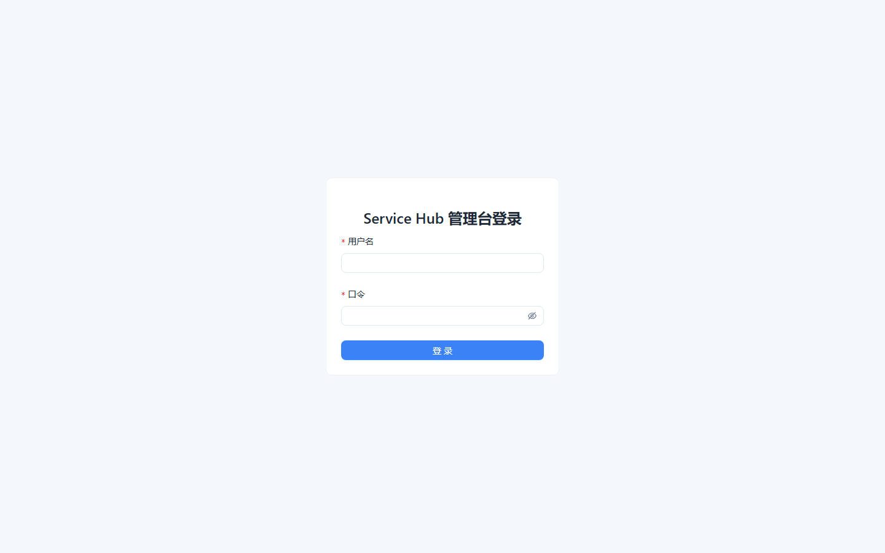

登录成功后进入概览页。右上角常驻显示 **服务状态 / 当前用户名（角色）**，点「登出」结束会话：

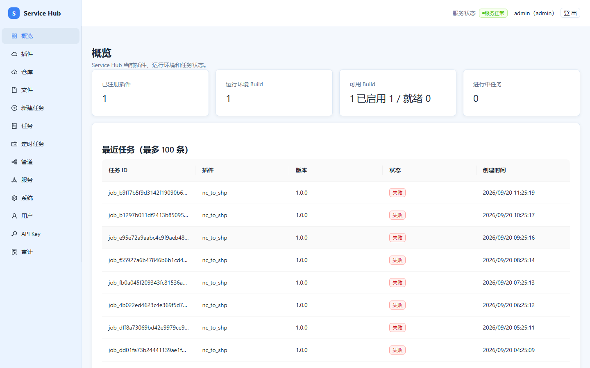

---

## 2. 角色与权限总览

系统采用**四级递增角色**（高角色包含低角色全部能力）：

| 角色 | 定位 | 一句话概括 |
|---|---|---|
| `viewer` | 只读 | 看插件、看文件列表、看任务与运行记录 |
| `operator` | 操作 | 上传文件、发起任务、管理定时任务、管理 Webhook |
| `publisher` | 发布 | 在 operator 之上，可查看插件构建详情等发布相关能力 |
| `admin` | 管理 | 用户管理、API Key、审计导出、服务部署、系统健康、停用定时任务 |

### 实测权限矩阵（4 角色 × 15 探针，2026-09-20）

| 操作 | viewer | operator | publisher | admin |
|---|---|---|---|---|
| 查看插件 / 仓库 / 文件 / 任务 / 管道 / 服务 | ✅ | ✅ | ✅ | ✅ |
| 系统健康 `/system/health` | ✅ | ✅ | ✅ | ✅ |
| 定时任务列表/创建 | ❌ 403 | ✅ | ✅ | ✅ |
| 上传文件 | ❌ 403 | ✅ 201 | ✅ 201 | ✅ 201 |
| 创建任务 | ❌ 403 | ✅（校验后入队） | ✅ | ✅ |
| 用户列表 / 创建用户 | ❌ 403 | ❌ 403 | ❌ 403 | ✅ 201 |
| 审计日志导出 | ❌ 403 | ❌ 403 | ❌ 403 | ✅ |
| 修改自己密码 | ✅（旧密码校验） | ✅ | ✅ | ✅ |

> 注：左侧菜单对所有角色**全部可见**，越权操作会在页面内收到红色「权限不足
> (403)」提示，而不是隐藏入口。这是现阶段已知的产品取舍（见 §10 反馈）。

viewer 访问定时任务页（角色徽标在右上角可见）：

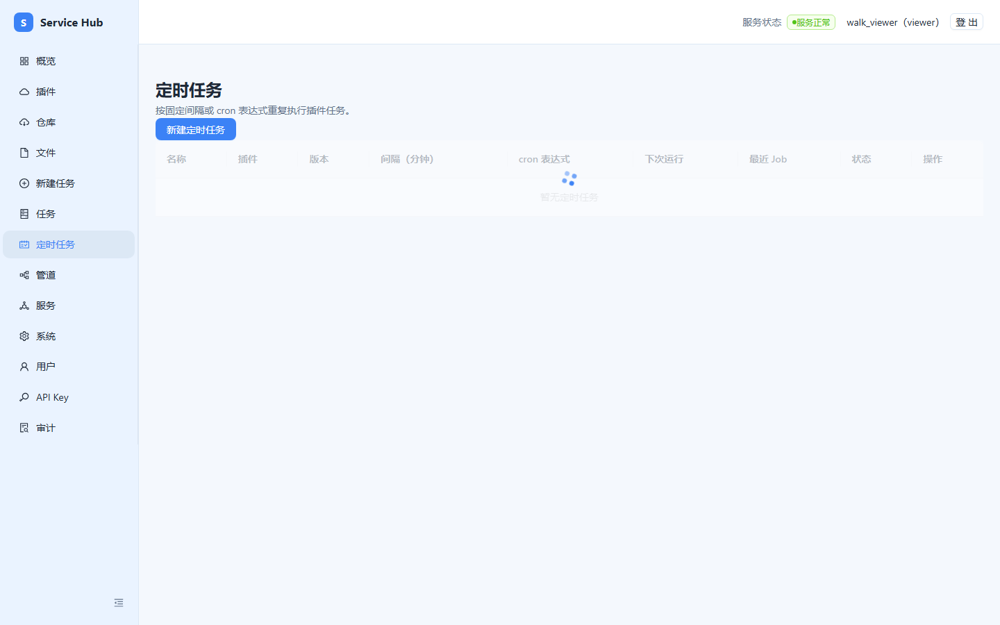

---

## 3. 登录、登出与密码

- **首次登录**：由管理员创建的账号若带「首次登录须改密」标记，登录后请先在
  右上角修改密码。
- **修改密码**：右上角用户菜单 → 修改密码；需要**旧密码**校验（旧密码错误返回 401）。
- **登录限流**：连续失败会触发 429 限流，响应带标准 `Retry-After` 头（秒数），
  页面会提示剩余等待时间，稍后再试。
- **会话**：浏览器会话即登录态；登出后立即失效。机器客户端请用 API Key（§8）。

---

## 4. 文件管理（operator 及以上）

入口：左侧「文件」。

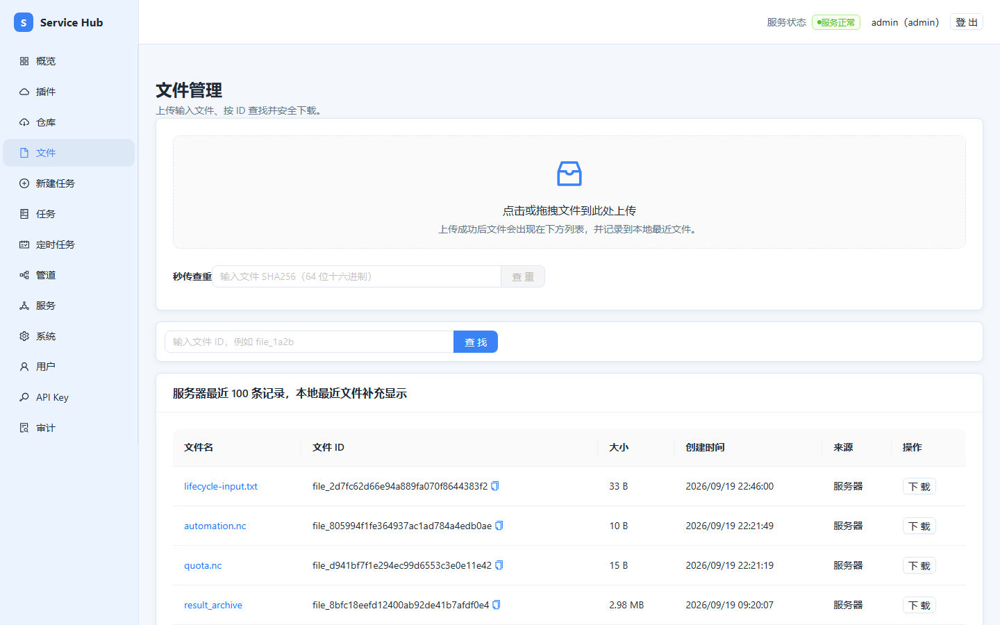

- **上传**：拖拽或点击上传区。≤10MB 单请求直传；**>10MB 自动走分块上传**
  （每块 5MB，页面上传与直传体验一致，无需关心差异）。
  实测：上传 12MB 文件产生 `chunk/init → 0,1,2 → complete` 请求序列，完成后列表出现 12.0 MB 记录。
- **秒传**：平台按 SHA256 查重，相同内容不会重复占用存储。
- **列表信息**：文件名、大小、上传者、时间、SHA256。
- **下载**：点击文件操作中的下载；**删除**：删除后若仍被历史任务引用会被引用守卫拒绝。

分块上传完成后的列表：

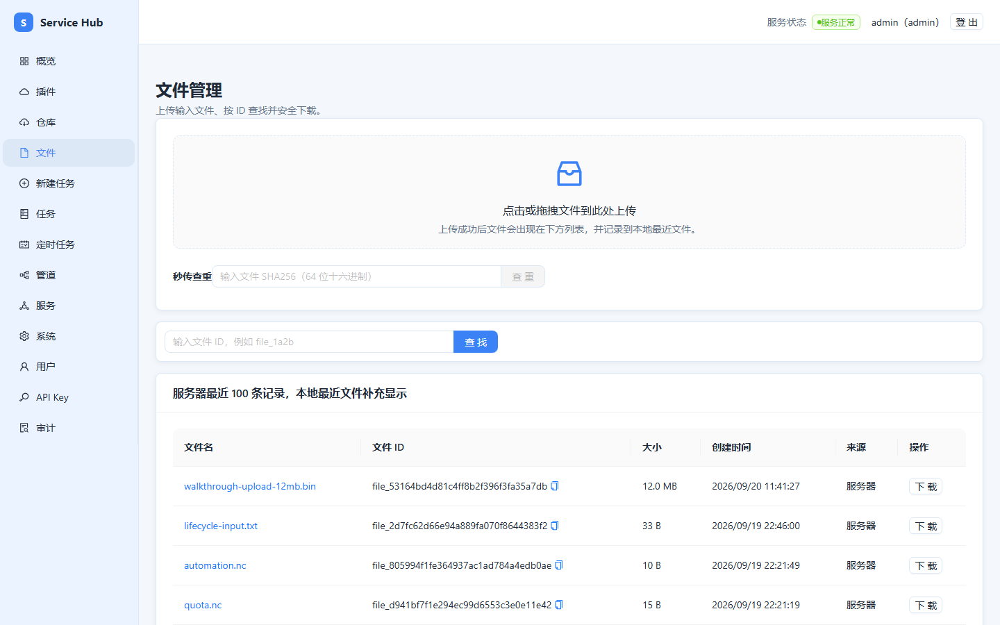

---

## 5. 发起任务（operator 及以上）

入口：左侧「新建任务」。

1. **选插件与版本**：从已启用插件中选择（如 `nc_to_shp` 1.0.0），运行时选
   `docker（容器）` 或 `conda-pack（进程）`。
2. **填输入**：表单模式按插件声明的输入项逐项填写（文件类输入从已上传文件中选择，
   如 `source_nc` 必须是 `.nc` 文件，扩展名不符会返回 422「插件输入文件扩展名无效」）；
   JSON 模式可直接编辑输入/参数 JSON。
3. **提交**：任务进入 `PENDING`（排队中）→ `RUNNING`（运行中）→ 终态
   `SUCCESS / FAILED / CANCELLED / TIMED_OUT`。
4. **取消**：任务详情页可发起取消（运行中会先进入「取消请求中」）。

新建任务页：

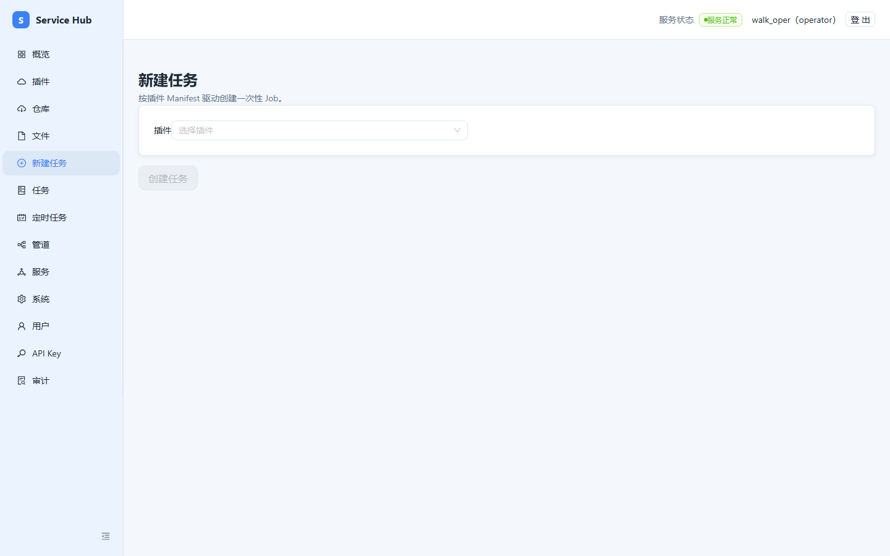

**实测闭环**（2026-09-20，operator 账号）：上传 2MB `.nc` → 创建任务返回
`job_id` 与 `build_id`，状态 `PENDING` → 运行器认领后 `RUNNING`（日志出现
进度「正在校验 NC 5%」）→ 因文件非合法 NetCDF 内容，任务 `FAILED`，日志含
`ERROR: plugin failed`。失败是预期（文件为空数据），用于验证全链路。

任务详情页可查看：状态时间线、**结构化日志**（`GET /jobs/{id}/logs`）、输出文件
（成功时）、以及 Webhook 回调记录（如配置了回调）。

---

## 6. 定时任务（operator 及以上；停用需 admin）

入口：左侧「定时任务」。点「新建定时任务」：

**方式一：按固定间隔**（默认）——每 N 分钟执行一次：

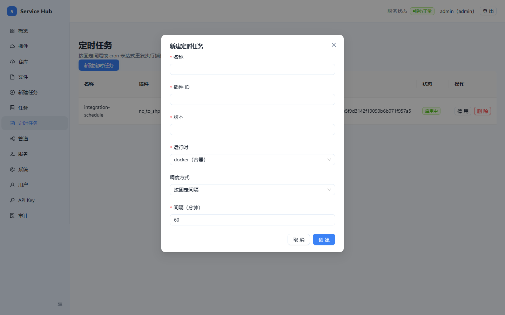

**方式二：按 cron 表达式**——把「调度方式」切换为「按 cron 表达式」，填写
5 段式表达式（`分 时 日 月 周`，如 `0 2 * * *` 每天 02:00），并选择
**错过执行策略**：

- `skip（跳过）`：错过的触发点直接跳过；
- `catch_up（逐个补跑）`：逐个补执行错过的触发；
- `latest（只补最近一次）`：只补执行最近一次错过的触发。

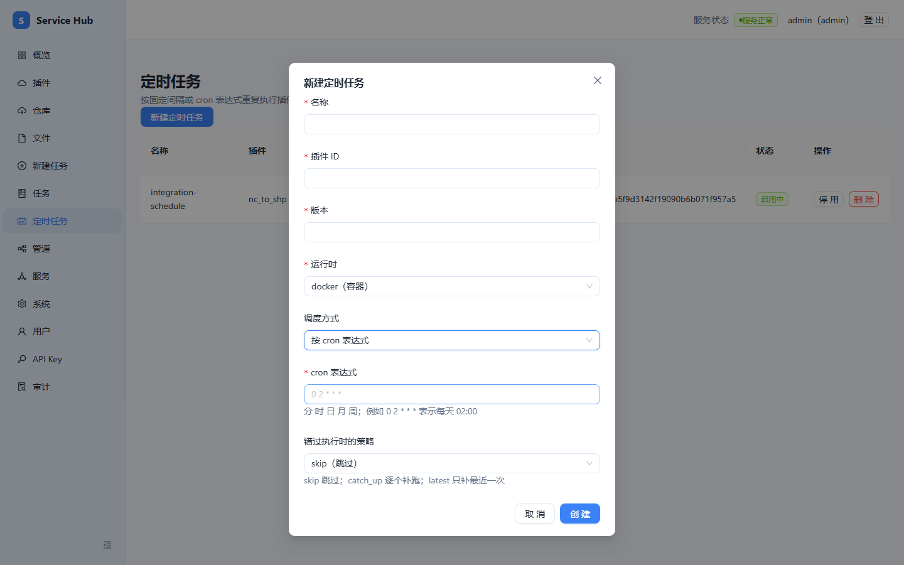

创建成功后列表显示 cron 表达式与**下次运行时间**：

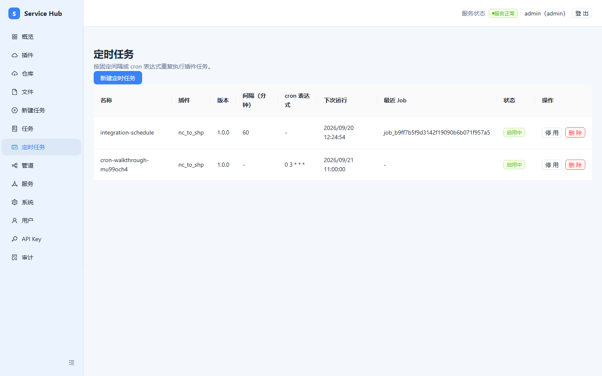

> 注意：同一任务**要么填间隔、要么填 cron**，两者同时提交会被 422 拒绝；
> 页面表单已保证只发送选中的一项。
> 实测：仅带 `cron_expr` 创建返回 201，列表正确显示 `0 3 * * *` 与下次运行时间。

列表内可**停用 / 启用 / 删除**（删除有二次确认）；停用与启用为 admin 专属，
operator 会收到 403。

---

## 7. 插件与仓库（viewer 可看，发布操作面向 publisher）

- **插件**：已安装的插件及其状态（安装中/就绪/已启用/失败）。点击可查看输入参数
  声明与运行时构建。
- **仓库**：插件构建产物的注册表视图。


插件安装/构建目前走**命令行工具链**（`hubctl` / 部署脚本），控制台提供查看与
结果确认，详见《单容器部署与脚本插件使用》。

---

## 8. 机器客户端：API Key（admin 创建）

为脚本/CI 创建 API Key：左侧「API Key」→ 新建，指定名称与**角色**
（viewer/operator/publisher/admin，角色即 Key 的权限上限）。

**Key 只在创建时返回一次**（形如 `hub_SEAmw1Lq…`），请立即妥善保存。

使用方式（实测）：

```bash
curl -sk https://${HUB_HOST}:8443/api/v1/files \
  -H "Authorization: Bearer hub_SEAmw1Lq..."
```

- Key 的角色为 operator 时：`GET /files` → 200，`GET /users` → 403；
- **吊销**（revoke）后同一 Key 立即返回 401。
- Key 会话不会被浏览器登录态遮蔽（Authorization 头优先于 Cookie）。

---

## 9. 管理员专区（admin）

### 9.1 用户管理

左侧「用户」：列表、**创建用户**（用户名 2-64 字符、密码达到最小长度、角色四选一）、
查看单用户存储/任务用量、**停用**（不可逆，停用后无法再启用，需重新建号）、
**重置密码**（返回一次性明文，请当场转交）。

### 9.2 服务管理

左侧「服务」：部署并管理长期运行的服务容器（受四项安全约束：非 root 运行、
端口 1024-65535、挂载限于数据根、镜像须本地存在）。

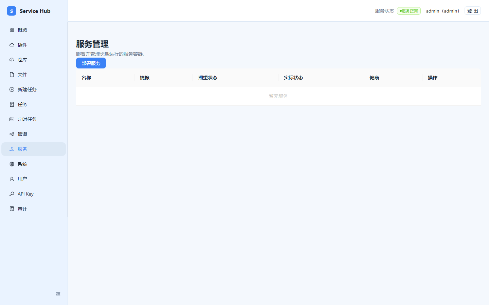

### 9.3 系统与审计

- 「系统」：平台健康与组件状态。
- 「审计」：全部敏感操作留痕，支持导出（仅 admin）。

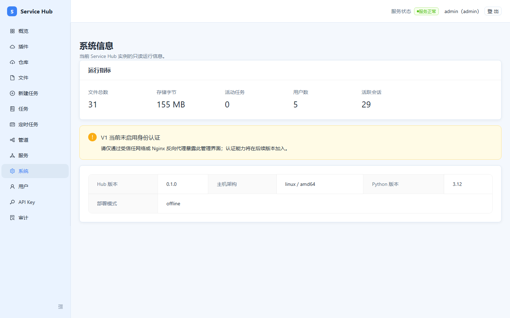

---

## 10. 常见提示与错误码

| 提示 | 含义 | 处理 |
|---|---|---|
| 请先登录 (401) | 未登录或会话过期 | 重新登录 |
| 凭证无效或已过期/已吊销 (401) | 会话或 API Key 失效 | 重新登录 / 换 Key |
| 权限不足 (403) | 角色不够 | 找管理员提权或换高权账号 |
| 登录失败次数过多 (429) | 触发限流 | 等待 `Retry-After` 秒数后重试 |
| 插件输入文件扩展名无效 (422) | 输入文件与插件声明不符 | 上传正确扩展名的文件（如 `.nc`） |
| 配额类错误 | 存储或任务数超配额 | `QUOTA_EXCEEDED` 清理空间；`UPLOAD_TOO_LARGE` 单文件超上限，联系管理员调额 |

---

## 11. 常见问题（FAQ）

**Q：浏览器提示证书不受信任？**
自签证书（SAN 含 IP，有效期至 2028-12）。内网可信环境可点「继续前往」；
正式使用建议替换为受信证书（edge 网关挂载点不变即可）。

**Q：大文件上传卡住？**
>10MB 走分块（5MB/块），失败会自动整批重试；极端网络下建议先测小文件。

**Q：任务一直 PENDING？**
运行器未认领。检查服务状态（右上角徽标）与 runner 容器是否健康。

**Q：为什么我能看到「用户」「审计」菜单但点开是 403？**
现阶段菜单不按角色裁剪（见下「已知取舍」）。直接忽略无权限的页面。

**Q：想给同事开账号？**
仅 admin 可创建；按需给最小角色：只看数据给 viewer，跑任务给 operator。

### 已知取舍（v1.0.0 记录）

1. 前端菜单不做角色裁剪，越权以 403 提示呈现；
2. 用户停用后无「启用」接口，恢复需重建账号；
3. 插件安装/构建走命令行工具链，控制台仅查看。

---

## 12. 附：本手册验证方式

- 权限矩阵：`admin / walk_viewer / walk_oper / walk_pub` 四账号 × 15 探针实测
  （原始数据见部署机 `.deploy-tools/role-matrix.json`）；
- 任务闭环：operator 真实上传→建任务→运行→日志→清理，全程 201/200；
- API Key：创建→使用（200/403 区间正确）→吊销→401；
- 页面截图：Edge 无头浏览器实测 13 个路由（2026-09-20）。
- 测试账号 `walk_viewer / walk_oper / walk_pub` 仍存在（强密码），不用时可由
  admin 在「用户」页停用。
