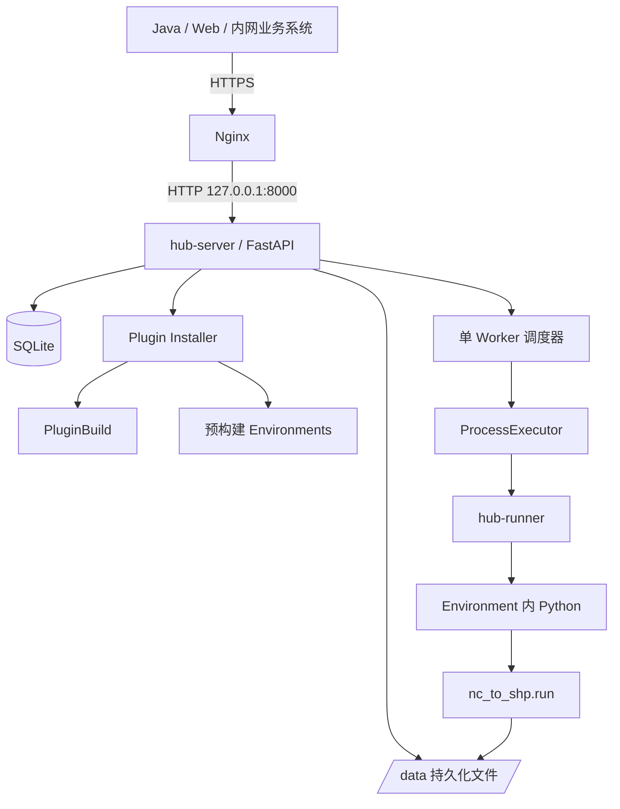
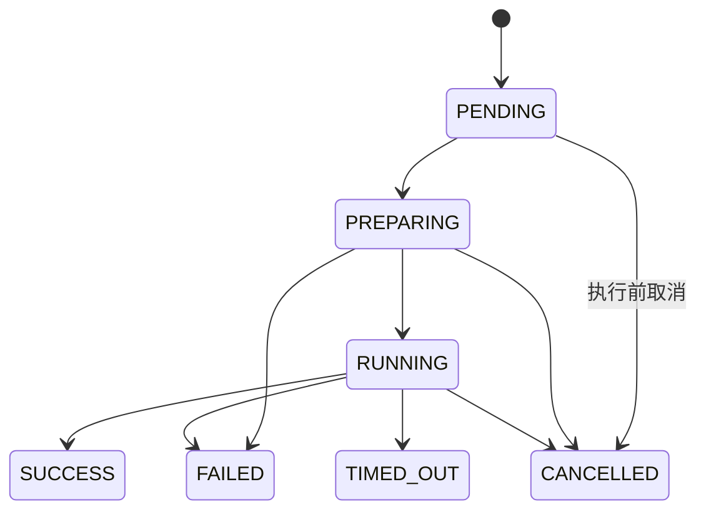

# 可执行 Python Service Hub MVP 设计

> 状态：待用户审阅
>
> 日期：2026-09-06
>
> 目标平台：Linux AMD64 开发/首次部署；Linux ARM64 离线生产后续适配

## 1. 目标与边界

本设计将现有的协议基础项目扩展为可在单台 Linux AMD64 服务器运行的 Python Service Hub MVP。完成后，其他内网系统可通过 Nginx 代理的 HTTPS API 安装并启用一个预构建的 `nc_to_shp` 插件，上传 NC 文件、创建异步 Job、查询进度和日志，并下载 Shapefile ZIP 输出。

MVP 的边界如下：

- Docker Compose 是唯一部署方式；Nginx 在宿主机负责 HTTPS 终止和反向代理。
- Hub 容器只绑定 `127.0.0.1:8000`；外部系统只能经 Nginx 访问。
- 初版无应用层认证。必须通过 Nginx、主机防火墙和内网边界限制来源；API Key 以后增加，不改变插件/Job 协议。
- 使用 SQLite 和本地持久化文件系统，单个后台 Worker，全局与单插件并发均为 1。
- 插件发布者自行构建环境；V1 唯一环境交付格式为 `conda-pack + tar.zst`。
- Hub 校验、安装和运行预构建环境，但绝不执行 `pip install`、`conda install`、依赖解析或编译。
- 首个真实插件为 `nc_to_shp`，可使用 GDAL、GeoPandas、netCDF4、xarray 等原生依赖。

非目标：多 Worker、PostgreSQL、对象存储、DockerExecutor、远程执行、复杂权限、插件签名、自动重试、任务优先级、WebSocket/SSE 和 ARM64 首次上线。

## 2. 当前基础与待完成内容

当前仓库已经提供两个可独立安装的包：

| 已有包 | 已经固定的能力 |
|---|---|
| `python-hub-contracts` | `plugin.yaml`、`build.json`、`job.json`、`result.json` 与 Runner 事件的严格 Pydantic 契约 |
| `python-hub-sdk` | `PluginContext`、输入/输出值对象、结果对象、取消与业务异常、进度事件、路径安全辅助函数 |

以下内容必须新增才能组成实际服务：`hub-server`、`hub-runner`、SQLite 数据访问层、文件存储、插件安装器、Environment 管理器、单 Worker 调度器、`ProcessExecutor`、Dockerfile、Compose、Nginx 示例、`nc_to_shp` 参考插件与端到端测试。

## 3. 总体架构



职责边界：

- **Nginx**：TLS 证书、内网来源限制、访问日志、10 GB 上传上限、长请求代理超时。
- **hub-server**：FastAPI 路由、输入校验、错误映射、SQLite 事务、文件管理、插件状态与 Job 调度。
- **Installer/EnvironmentManager**：安全解压 `.pypkg`、校验哈希与契约、校验当前 AMD64 平台、原子安装源码和预构建环境、健康检查。
- **Worker/ProcessExecutor**：领取一个 `PENDING` Job，准备运行目录，启动完整进程组，解析事件，处理取消/超时/崩溃。
- **hub-runner**：读取 `job.json`，加载入口函数，构造 `PluginContext`，调用 `run(params, inputs, context)`，原子写入 `result.json`。
- **Plugin**：只实现业务；读取声明输入，写入其 Job 的 `work/` 和 `output/`，通过 SDK 报告进度并返回结果。

## 4. 持久化目录和数据

宿主机部署根目录固定为 `/srv/python-service-hub`：

```text
/srv/python-service-hub/
├── compose.yaml
├── config/hub.yaml
└── data/
    ├── db/hub.db
    ├── plugins/<plugin_id>/<version>/<os>-<arch>/
    ├── environments/<environment_key>/
    ├── uploads/<file_id>/
    ├── jobs/<job_id>/
    │   ├── input/
    │   ├── work/
    │   ├── output/
    │   ├── logs/
    │   ├── job.json
    │   └── result.json
    └── tmp/
```

所有由协议记录的路径均为相对 POSIX 路径；主机绝对路径只由 Hub 内部解析。每个输入、输出、插件包和 Environment 包都保存 SHA256。数据库只保存管理元数据，不存放大文件或完整日志。

SQLite 最少包含下列关系：

```text
Plugin 1 ── * PluginVersion 1 ── * PluginBuild 1 ── 1 Environment
                                      │
                                      └── * Job ── * File
```

`PluginBuild` 在 V1 以 `(plugin_version_id, os, arch)` 唯一；禁止覆盖既有 Build。Job 必须永久记录解析后的精确 PluginVersion、PluginBuild、Environment fingerprint、参数快照和输入文件快照。

## 5. 插件环境、打包与注册

### 5.1 源码和 Build 分离

`plugin.yaml` 描述平台无关的业务契约，不得包含 `targets`、CPU 架构、绝对路径或密钥。`build.json` 描述某个不可变平台包。

同一 `nc_to_shp` 源码分别生成：

```text
nc_to_shp-1.0.0-linux-amd64.pypkg
nc_to_shp-1.0.0-linux-arm64.pypkg
```

AMD64 的原生依赖环境不能复制给 ARM64，反之亦然。

### 5.2 AMD64 发布者流程

1. 在 Linux AMD64 或兼容构建环境创建 Conda/Micromamba 环境，安装 Python、GDAL、GeoPandas、netCDF4、xarray、pyogrio 和 Hub SDK/Contracts wheel。
2. 在真实 AMD64 环境执行 healthcheck 和代表性 NC 转换任务。
3. 使用 `conda-pack` 打包环境，并用 `zstd` 生成 `runtime/env.tar.zst`。
4. 生成 `plugin.yaml`、AMD64 `build.json`、源码哈希、环境哈希和 `checksums.sha256`。
5. 使用 ZIP 容器打包为 `.pypkg`。

包结构固定为：

```text
nc_to_shp-1.0.0-linux-amd64.pypkg
├── plugin.yaml
├── build.json
├── src/
├── runtime/env.tar.zst
├── README.md
└── checksums.sha256
```

### 5.3 Hub 安装和启用流程

```text
POST /plugins/install
  → 接收包并计算 SHA256
  → 安全解压到 /data/tmp
  → 校验 checksums、plugin.yaml、build.json
  → 校验 linux/amd64、SDK/Python 版本及环境归档
  → 原子安装 plugin 和 Environment
  → 使用环境 Python 执行 healthcheck
  → 数据库事务登记为 READY

POST /plugins/{id}/{version}/enable
  → 仅 READY Build 可转换为 ENABLED
```

发生失败时，清理临时目录且数据库状态为 `FAILED`；不得留下可执行半安装目录。ARM64 包上传到 AMD64 Hub 时返回 `PLATFORM_MISMATCH`。

## 6. Job 生命周期和执行流程

Job 状态机：



创建 Job 时依次校验：Plugin → 版本 → 当前平台 Build → `ENABLED` → Environment `READY` → 参数 → 输入结构 → File 存在性/大小/扩展名。通过后，Hub 写不可变 `job.json`，创建 Job 目录并返回 `201 PENDING`。

Worker 一次只执行一个 Job：

1. 领取 `PENDING`，原子变为 `PREPARING`；准备输入与运行命令。
2. 使用 Environment 内的 Python 启动 `hub-runner` 进程组。
3. Runner 加载插件入口，插件通过 `@@HUB@@` JSON 事件汇报进度和日志。
4. 进程正常结束后，Runner 原子创建 `result.json`。
5. Hub 校验结果和 output 真实路径/存在性，登记输出 File；全部通过后变为 `SUCCESS`。
6. 取消或超时必须终止整个进程组；最终分别为 `CANCELLED` 或 `TIMED_OUT`。

Hub 重启时，遗留 `PREPARING`/`RUNNING` Job 标记为 `FAILED`，稳定错误码为 `HUB_RESTARTED`。

## 7. REST API 和统一错误

API 前缀为 `/api/v1`：

```text
POST /plugins/install
GET  /plugins
GET  /plugins/{plugin_id}
POST /plugins/{plugin_id}/{version}/enable
POST /plugins/{plugin_id}/{version}/disable

POST /files
GET  /files/{file_id}
GET  /files/{file_id}/download

POST /jobs
GET  /jobs
GET  /jobs/{job_id}
POST /jobs/{job_id}/cancel
GET  /jobs/{job_id}/logs
GET  /jobs/{job_id}/outputs

GET  /system/health
GET  /system/info
```

失败始终返回：

```json
{
  "success": false,
  "error": {
    "code": "PLUGIN_NOT_ENABLED",
    "message": "插件 nc_to_shp 版本 1.0.0 未启用",
    "details": null
  }
}
```

必须至少实现稳定错误码：`PLUGIN_NOT_FOUND`、`PLUGIN_VERSION_NOT_FOUND`、`PLUGIN_NOT_ENABLED`、`PLATFORM_MISMATCH`、`RUNTIME_PACKAGE_REQUIRED`、`SDK_VERSION_INCOMPATIBLE`、`MANIFEST_INVALID`、`FILE_NOT_FOUND`、`FILE_TYPE_NOT_ALLOWED`、`JOB_STATE_CONFLICT`、`EXECUTION_TIMEOUT`、`RESULT_INVALID`、`OUTPUT_FILE_MISSING`、`HUB_RESTARTED`、`UNEXPECTED_ERROR`。

## 8. Docker、Nginx 和运维

Compose 服务：

```yaml
services:
  hub:
    image: python-service-hub:0.1.0-linux-amd64
    restart: unless-stopped
    ports:
      - "127.0.0.1:8000:8000"
    volumes:
      - ./config/hub.yaml:/app/config/hub.yaml:ro
      - ./data:/data
```

Nginx 监听 `443`，持有证书，反向代理到 `http://127.0.0.1:8000`，并配置 `client_max_body_size 10g`、至少 3700 秒的代理读写超时、来源 IP 白名单和访问日志。Hub 不直接暴露公网。

镜像使用同一 Dockerfile 分别构建 `linux/amd64` 和后续 `linux/arm64`。离线交付以明确架构的 `docker save` tar、Compose、配置和 SHA256 清单组成；生产机只做校验、`docker load` 和 `docker compose up -d`。

## 9. `nc_to_shp` 端到端验收

`nc_to_shp` 的 `plugin.yaml` 声明一个 `.nc/.h5/.hdf5` 输入、可选 `start_time`、`end_time`、`target_epsg`、`method` 参数，以及必须的 `files` 输出。插件入口读取输入、检查取消、周期性报告进度，将完整 Shapefile 打成 ZIP 写入 `output/`，返回一个 `OutputFile`。

验收链路：

1. 在 AMD64 Docker Compose 部署 Hub，`GET /api/v1/system/health` 返回 `UP`。
2. 上传、安装并启用 `nc_to_shp-*-linux-amd64.pypkg`；上传 ARM64 包必须失败。
3. 上传真实 `.nc` 文件，创建 Job。
4. Job 状态从 `PENDING` 到 `RUNNING`，可查询进度、日志。
5. 任务完成为 `SUCCESS`，输出 ZIP 可下载且包含 `.shp/.shx/.dbf` 等完整文件。
6. 分别验证非法包、无效参数、取消、超时、插件异常、缺失输出和 Hub 重启恢复。

## 10. 分阶段交付顺序

1. **基础设施层**：项目包结构、配置、SQLite/SQLAlchemy、迁移、数据模型、文件存储和目录安全。
2. **运行层**：`hub-runner`、Job 协议桥接、单 Worker、`ProcessExecutor`、事件/日志、状态机、取消和超时。
3. **安装层**：`.pypkg` 安全解压、哈希/平台/清单校验、Environment 安装、healthcheck、启用/停用。
4. **服务层**：FastAPI 路由、错误映射、文件上传/下载、Job API、OpenAPI 和重启恢复。
5. **交付层**：Dockerfile、Compose、AMD64 Nginx/部署说明、离线归档与备份恢复。
6. **端到端层**：`nc_to_shp` AMD64 包、真实 NC 测试、完整验收；随后按同一协议制作 ARM64 镜像与插件包。

每一阶段必须有自动化测试；最后以 Docker Compose 真实运行的端到端测试作为发布门禁。
