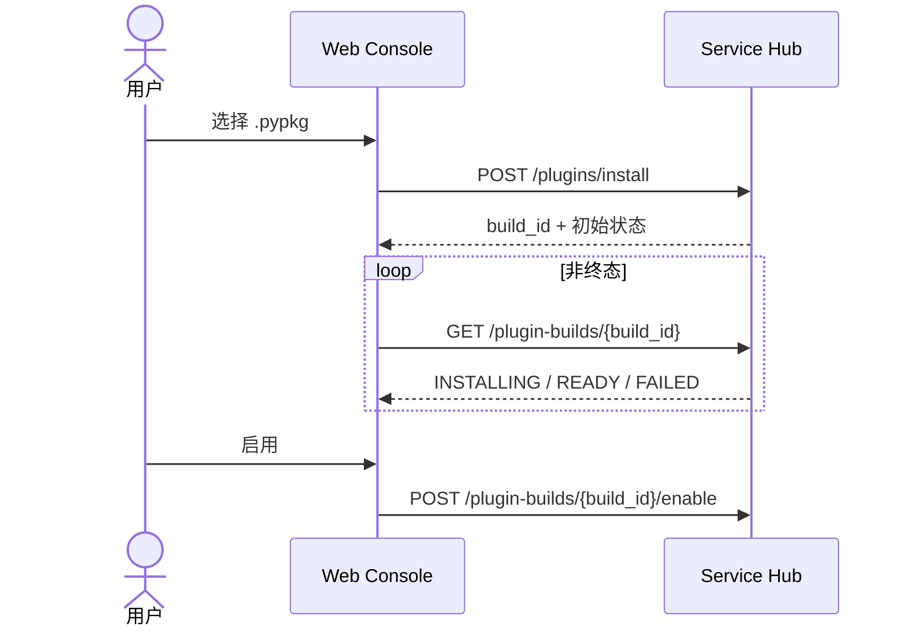
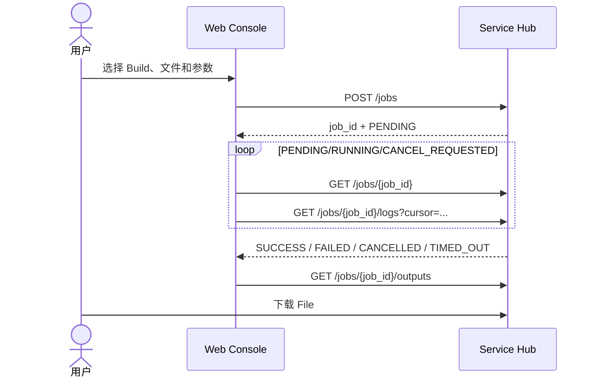

# Python Service Hub Web 管理台设计

## 1. 文档信息

- 状态：已确认，待实施
- 目标版本：Web Console V1
- 开发分支：`feature/service-hub-web-console`
- 基线分支：`feature/single-container-hub`
- 后端基线提交：`795f886`
- 目标平台：Linux AMD64；本地支持 Windows Docker Desktop 构建

## 2. 背景与目标

Python Service Hub 已提供单容器后端、`conda-pack` 与 Docker 两种一次性 Job 运行时、插件安装、文件上传、任务执行、日志及输出下载能力。当前主要通过 `hubctl` 或 REST API 操作，首次部署和日常使用仍要求操作者理解较多接口细节。

Web Console V1 的目标是提供简洁的中文管理界面，使操作者可以完成以下完整链路：

1. 查看 Hub 健康和运行状态；
2. 上传并安装 `.pypkg`；
3. 查看和启用 Plugin Build；
4. 上传输入文件；
5. 选择插件、版本和运行时创建 Job；
6. 查看任务状态与增量日志；
7. 取消任务并下载输出；
8. 查看系统信息和无认证部署提示。

V1 不修改插件协议、Job Runtime Protocol、Runner Event Protocol 或现有 REST API 语义。统计信息优先由前端基于已有列表计算，不为界面引入不必要的新接口。

## 3. 设计原则

- 前后端边界清晰：前端只调用公开 `/api/v1`，不访问 `/internal/v1`。
- 同源部署：浏览器只访问 Web 容器，避免生产环境 CORS 和 API 地址配置。
- 一条命令部署：后端与 Web 容器由同一个 Compose 项目管理。
- 不削弱后端安全边界：前端不是认证或授权层。
- 接口事实优先：只展示后端实际支持的动作；不存在的列表、删除或统计能力不伪造。
- 可恢复交互：失败不清空表单，运行任务自动轮询，终态停止轮询。
- 简约实用：淡蓝色、低噪音、信息密度适中的内部管理台。
- 独立可测试：API、状态映射、表单、页面流程和容器路由分别测试。

## 4. 技术栈

- React 18
- TypeScript
- Vite
- Ant Design 5
- React Router
- TanStack Query
- Axios
- Vitest
- Testing Library
- Nginx

前端工程位于 `web/`。生产构建采用多阶段 Dockerfile：Node 阶段生成静态文件，Nginx 阶段只包含构建产物和路由配置。

## 5. 总体架构

```mermaid
flowchart LR
    U[浏览器] -->|HTTP 8080| W[service-hub-web\nNginx + React]
    W -->|静态资源| U
    W -->|/api/v1/*| H[service-hub:8000]
    W -. 拒绝 .-> I[/internal/v1/*]
    H --> A[Hub API]
    H --> C[conda-runner]
    H --> D[docker-runner]
    D --> S[Docker Socket]
    A --> V[(HUB_HOST_DATA_DIR)]
    C --> V
    D --> V
```

生产 Compose 包含两个长期服务：

| 服务 | 职责 | 宿主端口 | 数据与权限 |
| --- | --- | --- | --- |
| `service-hub-web` | React 静态资源和 `/api` 反向代理 | `127.0.0.1:8080:8080` | 不挂载 Hub 数据和 Docker Socket |
| `service-hub` | API、conda Runner、Docker Runner | 可保留 `127.0.0.1:8000:8000` 供本机诊断 | 挂载数据目录和 Docker Socket |

前端代码只请求相对路径 `/api/v1/...`。开发环境由 Vite 将 `/api` 代理到 `http://127.0.0.1:8000`；生产环境由 Nginx 转发到 `http://service-hub:8000`。

外部 Nginx、TLS 和认证后续统一接在 `service-hub-web` 前面。后端 8000 不对外网开放。

## 6. 前端目录与模块边界

```text
web/
├── src/
│   ├── api/             # Axios 实例、端点函数、错误规范化
│   ├── components/      # 状态标签、上传、日志、空状态等复用组件
│   ├── hooks/           # TanStack Query 查询、轮询和 mutation
│   ├── layouts/         # 侧边栏、顶部状态栏、内容布局
│   ├── pages/           # 路由页面
│   ├── routes/          # 路由定义与 404
│   ├── theme/           # Ant Design Token 与全局样式
│   ├── types/           # 与 REST API 对齐的 TypeScript 类型
│   ├── utils/           # 状态映射、文件名、大小与时间格式化
│   ├── App.tsx
│   └── main.tsx
├── Dockerfile
├── nginx.conf
├── package.json
├── tsconfig.json
└── vite.config.ts
```

模块职责：

- `api` 只负责网络和响应转换，不包含页面状态；
- `hooks` 管理缓存、轮询、失效和 mutation；
- `components` 不直接拼接 API URL；
- `pages` 负责编排查询与交互；
- `types` 以当前 Pydantic 响应为依据，不臆造字段；
- `utils` 保持纯函数，便于单元测试。

## 7. 页面与路由

### 7.1 概览 `/`

显示 Hub 健康、插件数量、可用 Build 数量、任务状态统计和近期任务，并提供“安装插件”“上传文件”“新建任务”快捷入口。

使用：

- `GET /api/v1/system/health`
- `GET /api/v1/system/info`
- `GET /api/v1/plugins`
- `GET /api/v1/jobs`

### 7.2 插件管理 `/plugins`

支持上传 `.pypkg`、查看插件版本及 Docker/conda-pack Build、轮询安装状态、启用 Build、展示失败信息。只有后端已实现删除接口时才展示删除按钮。

使用：

- `POST /api/v1/plugins/install`
- `GET /api/v1/plugins`
- `GET /api/v1/plugins/{plugin_id}`
- `GET /api/v1/plugin-builds/{build_id}`
- `POST /api/v1/plugin-builds/{build_id}/enable`

### 7.3 文件管理 `/files`

支持拖拽上传、显示上传进度、展示文件元数据、复制 `file_id` 和下载。若后端没有文件列表接口，页面显示本浏览器会话上传记录，并允许通过 `file_id` 查询，明确标记该限制。

使用：

- `POST /api/v1/files`
- `GET /api/v1/files/{file_id}`
- `GET /api/v1/files/{file_id}/download`
- `DELETE /api/v1/files/{file_id}`（仅接口存在时开放）

### 7.4 新建任务 `/jobs/new`

采用四步流程：选择插件、选择版本与运行时、配置输入文件、填写参数并确认。插件 Manifest 可用时按参数定义生成表单，同时提供 JSON 高级模式。文件输入可以选择当前会话上传记录，也可以手工填写 `file_id`。

提交前展示最终请求 JSON，成功后跳转 `/jobs/{jobId}`。

使用：`POST /api/v1/jobs`。

### 7.5 任务中心 `/jobs`

显示 Job ID、插件、版本、运行时、状态、创建/开始/结束时间、耗时和错误摘要。支持进入详情、取消和下载输出。`PENDING`、`RUNNING` 与 `CANCEL_REQUESTED` 默认每两秒轮询，终态停止。

使用：

- `GET /api/v1/jobs`
- `GET /api/v1/jobs/{job_id}`
- `POST /api/v1/jobs/{job_id}/cancel`

### 7.6 任务详情 `/jobs/{jobId}`

包含基本信息、执行日志和输出文件三个标签页。日志按 cursor 增量获取，支持自动滚动、暂停和复制。输出通过 File API 下载，不暴露 Hub 内部路径。

使用：

- `GET /api/v1/jobs/{job_id}`
- `GET /api/v1/jobs/{job_id}/logs`
- `GET /api/v1/jobs/{job_id}/outputs`
- `GET /api/v1/files/{file_id}/download`
- `POST /api/v1/jobs/{job_id}/cancel`

### 7.7 系统信息 `/system`

显示 Hub 健康、版本、目标平台、数据目录状态、运行时与 API 地址，并持续显示“V1 无应用层认证”的安全提示。

使用：

- `GET /api/v1/system/health`
- `GET /api/v1/system/info`

## 8. 核心交互流程

### 8.1 插件安装



### 8.2 Job 执行



## 9. 视觉规范

整体采用简约淡蓝主题：

| Token | 值 |
| --- | --- |
| 主色 | `#3B82F6` |
| 页面背景 | `#F4F8FD` |
| 侧边栏 | `#EAF3FF` |
| 卡片 | `#FFFFFF` |
| 边框 | `#DCE8F5` |
| 正文 | `#1F2937` |
| 次要文字 | `#64748B` |

卡片使用轻边框和浅阴影，圆角统一为 8px，不使用大面积渐变和复杂动画。桌面端以 1280px 以上为主要目标；较窄屏幕折叠侧栏，V1 不承诺完整手机端操作体验。

状态颜色：

- `READY`、`ENABLED`、`SUCCESS`：绿色；
- `PENDING`、`INSTALLING`：蓝色；
- `RUNNING`：青色并显示轻量动态标记；
- `CANCEL_REQUESTED`：橙色；
- `FAILED`、`TIMED_OUT`：红色；
- `CANCELLED`、`DISABLED`：灰色。

## 10. 状态、错误与恢复

- 上传显示进度，防止重复提交；
- 插件安装和运行任务使用有界轮询；
- 页面卸载后停止轮询；
- 网络暂时失败时保留最后成功数据并提供重试；
- 操作失败不清空参数表单；
- 取消操作二次确认；
- 后端统一错误解析为 `code`、`message`、`details`；
- 默认展示中文 `message`，详情折叠区显示 code/details；
- 日志按纯文本渲染，不解释 HTML；
- 下载文件名使用响应元数据并进行安全清理；
- 404 页面保留返回概览入口。

浏览器仅在本地存储 UI 偏好和近期上传的 `file_id`/元数据，不保存文件内容、Runner Token 或其他秘密。

## 11. 安全设计

- Web 不保存或传递 `HUB_RUNNER_TOKEN`；
- Nginx 对 `/internal/v1` 明确返回 404 或 403；
- 生产前端只使用同源 `/api`；
- 文件名、日志、错误详情均以文本方式渲染；
- 不使用 `dangerouslySetInnerHTML` 展示服务端内容；
- Web 容器不挂载 `/data` 或 Docker Socket；
- 默认仅绑定 `127.0.0.1:8080`；
- 外部访问必须由公司 Nginx 实现 TLS、认证、IP 策略和上传大小限制；
- 前端按钮隐藏不等于授权，所有敏感校验仍由后端承担。

## 12. Compose 与镜像发布

新增镜像：

```text
python-service-hub-web:1.0.0-linux-amd64
```

Compose 统一启动：

```bash
HUB_HOST_DATA_DIR=/srv/service-hub-data docker compose up -d
```

离线发布包增加 Web 镜像 tar，并让 `install.sh` 同时导入两个镜像。发布包仍包含单份 Compose、`hubctl` 和生命周期脚本。

构建过程：

1. Windows Docker Desktop 或 Linux AMD64 构建后端镜像；
2. 构建 Web 静态产物及 Nginx 镜像；
3. 分别 `docker save`；
4. 生成 SHA256SUMS；
5. 上传 Linux AMD64 服务器；
6. 导入两镜像并通过一个 Compose 项目启动。

## 13. 测试与验收

### 13.1 单元测试

- 后端错误格式归一化；
- Job/Build 状态映射；
- 文件大小、耗时和时间格式化；
- 输入参数和 Job 请求生成；
- 下载文件名清理。

### 13.2 组件测试

- 文件与插件上传；
- Build/Job 状态标签；
- 动态参数表单；
- 增量日志；
- 错误详情与确认弹窗。

### 13.3 页面流程测试

使用 Mock API 完成：插件上传、等待 READY、启用、上传输入、创建 Job、查看日志和下载输出。

### 13.4 容器冒烟测试

- `GET /` 返回前端页面；
- `GET /api/v1/system/health` 返回 200；
- 直接刷新 `/jobs/{id}` 返回 `index.html`；
- `/internal/v1/*` 被 Web Nginx 拒绝；
- Compose 只有 Web 对浏览器开放入口；
- Web 容器不拥有 Docker Socket 与 Hub 数据权限；
- 后端原有 conda-pack/Docker 双运行时验收继续通过。

## 14. V1 范围外

- Hub 应用层用户认证和 RBAC；
- 插件源码在线编辑器；
- 浏览器内构建插件环境；
- 工作流编排和定时任务；
- WebSocket 实时日志；
- 多租户、配额和审计平台；
- 完整移动端适配；
- 自定义仪表盘和复杂图表。

## 15. 完成标准

以下全部通过才算 Web Console V1 完成：

- 前端六类业务页面与系统信息页可用；
- 现有公开 API 均通过统一类型化客户端调用；
- 插件、文件、Job、日志和输出主流程通过；
- Docker Compose 一条命令启动前后端；
- Windows Docker Desktop 可构建 Linux AMD64 两个镜像；
- Linux AMD64 可离线导入和运行；
- Nginx 拒绝 `/internal/v1`；
- 前端测试、后端非集成测试、容器冒烟和 NC 双运行时验收通过；
- 部署与使用文档提供完整中文命令。
